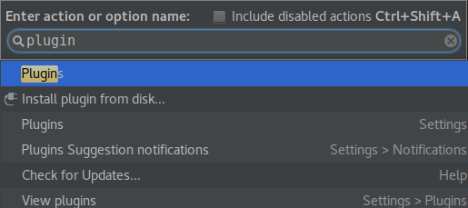
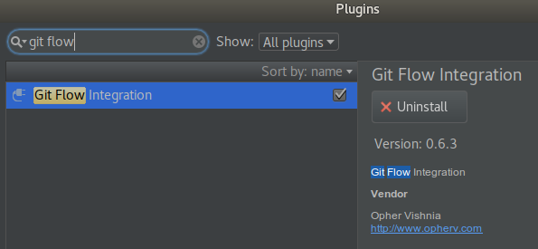
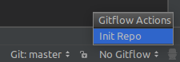
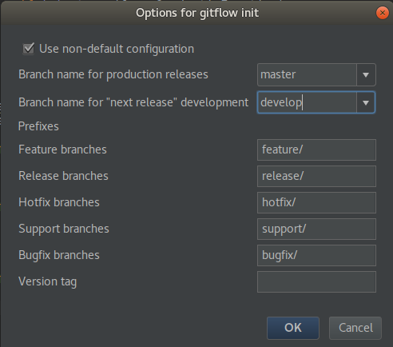
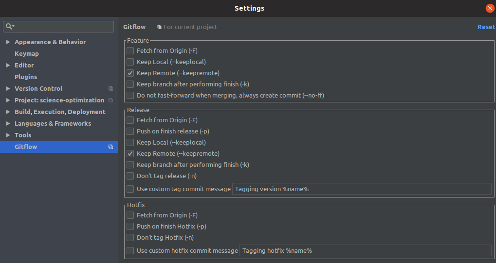
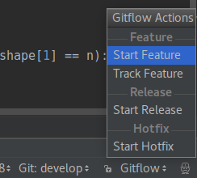
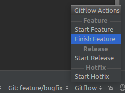

# GitFlow Tutorial

Gitflow Workflow is a Git workflow design. The Gitflow Workflow defines a strict branching model designed around the project release. This provides a robust framework for managing larger projects.  

## Intallation

Gitflow is a wrapper around Git. The installation process for Gitflow is straightforward. Packages for Gitflow are available on multiple operating systems. 

Linux:
```shell
$ sudo apt install git-flow
```

Mac:
```shell
$ brew install git-flow
```

Windows: [Download and install git-flow](https://git-scm.com/download/win)

### IDE Plugin

On your IDE, search (e.g. Ctrl+Shift+A on PyCharm) for __Plugins__: 



Inside __Plugins__, search and install the __Git Flow Plugin__:




### Gitflow initialization

The first step is to initialize Gitflow on your existing repo:

```shell
$ git flow init
```
or



Branch's name should follow the naming convention:



This operation creates the __develop branch__ on your local machine (__For project owners only__: it is necessary to push the develop branch).

This step will be executed only one time per git repo.

It is also important to check "Keep Remote" on the GitFlow settings:




## Usage

Let's suppose you have to fix someone's bug (of course it is someone's, you do not make mistakes) or you are implementing a new functionality. The following steps will be followed:

1. Create a new feature branch (e.g. *bugfix*) from develop branch:

```shell
$ git flow feature start
```
or



Until this point, the new feature branch is only available on your local machine and you can make commits normally. However, it is also necessary to __push your commits to make the feature branch available on remote__.

You should work on this feature branch until this specific feature is done, but it is also recommended to distribute your work across feature branches in order to make them traceble and easier to maintain.

2. Finish the new feature:

```shell
$ git flow feature finish
```
or



Finishing the feature merges the feature branch on the develop branch on your __local machine__ (PAY ATTENTION TO THIS). So it is  still necessary to push the updates on the local develop branch to the remote develop branch. But before this operation, it is highly recommended to update your local develop branch and make the necessary changes.

3. Push local changes on develop branch to remote develop branch: `$ git push`.

For hotfix and release branches the steps are the similar.

## Additional info

Additional info on Gitflow workflow can be found [here](https://www.atlassian.com/git/tutorials/comparing-workflows/gitflow-workflow).
